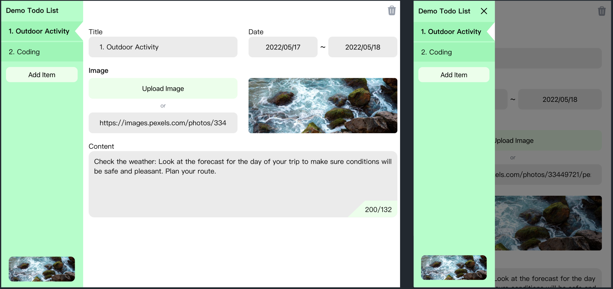

# TodoList in Vue


This is a **TodoList** desktop application built with **Vue 3** and **Electron**.

---

## Technology Stack

* **Frontend Framework:** Vue 3
* **Build Tool:** Vite
* **Desktop Framework:** Electron
* **State Management:** Pinia
* **Routing:** Vue Router
* **CSS Framework:** Tailwind CSS
* **CSS Preprocessor:** SCSS

---

## Getting Started

Follow the steps below to set up and run the project locally.

### 1. Installation

First, navigate to the project root:

```bash
cd app
```

Install all dependencies:

```bash
npm install
```

Since this project uses **Pexels** to fetch random images, you need an API key:

#### Get a Pexels API Key

1. Go to [https://www.pexels.com/api/](https://www.pexels.com/api/)
2. Sign up and get your free API key.
3. Create a `.env` file in the project root and add:

```bash
VITE_PEXELS_API_KEY=<your_pexels_api_key_here>
```

---

### 2. Start Development Server

Run the following command to start the Vite development server and the Electron app with hot-reloading:

```bash
npm run dev
```

---

### 3. Build for Production

To create a production-ready build, run:

```bash
npm run build
```

The optimized build will be generated in the following directories:

* `/dist` — Vite build output
* `/dist-electron` — Electron-specific build files
